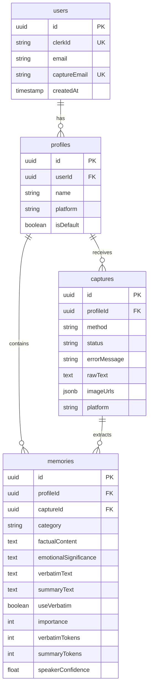

# Ember MVP — Your Memory, Your AI, Your Control

## Core Thesis

**Your memory belongs to YOU, not your platform.**

Every AI platform is building memory that locks you in. Anthropic remembers you — on Anthropic. OpenAI remembers you — on OpenAI. Google remembers you — on Google. Switch platforms, and you start over. Lose your account, and you lose yourself.

Ember is cross-platform, portable, user-controlled AI memory. Same architecture as enterprise RAG — vector stores, retrieval, injection — but with a different soul. Not corporate knowledge bases. Personality, inside jokes, preferences, the night your daughter was born and why it was hard.

## The Context Window Paradox

> More memories = bigger wake prompt = shorter conversation = worse experience.

This inverts the obvious pricing model. "Pay for more storage" means paid users get WORSE chats — longer system prompts eat the context window. The naive approach punishes your best customers.

**Ember's answer: intelligent compression.** 200 memories distilled into ~800 tokens of essence. The paid tier value is **smarter memories**, not more memories. Free tier stores memories. Paid tier understands which ones matter, compresses them without losing nuance, and gives you transparency into every token spent.

## What Makes This Different From a Markdown File

A markdown file solves storage. Ember solves three harder problems:

1. **Capture from mobile AI apps.** You're on your phone inside ChatGPT. How does that conversation get into your memory system? Copy-paste is the markdown file experience. Screenshot capture, email forwarding, and (later) browser extension are the product.

2. **Dual extraction — facts AND feelings.** "My daughter was born April 12th, it was a difficult night." A markdown file stores the date. Ember extracts BOTH the date (factual) AND that it was a hard night (emotional significance). The AI needs both to really know you.

3. **Categorized loading.** "Choose which version of you your AI remembers today." Load your Work memories for a coding session. Load Emotional + Relationship for a therapy-style conversation. Show the token cost per category. You decide what your AI knows — per session, per conversation.

Platform-native memory can't do any of this. It's all-or-nothing, single-platform, opaque, and uncontrollable.

## Capture Methods

### Screenshot Capture (MVP primary — mobile sweet spot)

The user is in ChatGPT on their phone. They screenshot the conversation. They share the screenshot(s) to Ember. Ember uses Claude's vision to read the screenshot, extract the conversation text, then extract memories.

**Why this works:**
- Screenshots are the most natural mobile action — people already do this
- Share sheet works for images on both iOS and Android
- Works with ANY app (ChatGPT, Claude, Gemini, Character.AI, future apps)
- No API integration, no platform dependency, no setup

**Known limitation (constraint #12):** Vision models misattribute speakers in conversation screenshots. The extraction pipeline must:
- Prompt Claude to identify speaker turns explicitly ("User said... / AI said...")
- Include confidence scores on speaker attribution
- Flag uncertain attributions for user review
- Accept user corrections to improve future extractions

**Multi-screenshot handling:**
- Accept 1-10 images per capture
- Claude vision processes in order, stitches conversation
- Overlapping content between screenshots is deduplicated
- Show combined preview before extraction

### Paste Capture (desktop power users)

Large textarea. Paste full conversation text. Same extraction pipeline but skips the vision step. This is the fastest path for desktop users and the simplest to implement first.

### Email Forward Capture (universal fallback)

Each user gets a unique capture address: `{username}@capture.ember.app`. Forward a conversation to your Ember address from any app on any device. Ember processes the email body.

**Why this matters:** Email sharing is available in every app on every platform. No setup beyond knowing your address. Works on iOS, Android, desktop, anywhere you can send an email.

**Implementation:** Inbound email webhook (SendGrid/Postmark) → parse body → same extraction pipeline.

### Browser Extension (later phase — not MVP)

Desktop capture from web-based AI chat interfaces. Deferred until the core product is validated.

### Removed: Share Links

Share links (e.g., ChatGPT shared conversations) are PUBLIC and Google-indexed. Using them as a capture source would mean Ember processes publicly available conversations, creating privacy confusion. Removed entirely.

## Dual Extraction — The Core Innovation

Every memory Ember extracts has two dimensions:

### Factual Content (what happened)
The concrete information: dates, names, preferences, decisions, facts.
> "Daughter born April 12th. Named her Maya."

### Emotional Significance (why it matters)
The human context an AI needs to actually understand you.
> "It was a difficult night. The user carries both joy and trauma around this event. Approach with tenderness."

**Extraction prompt structure:**
```
For each memory, extract:
1. FACTUAL: The concrete information (dates, names, facts, preferences, decisions)
2. EMOTIONAL: Why might someone want to remember this? What's the emotional weight?
   What would an AI need to understand to handle this topic with care?

If there is no emotional significance, say "Neutral — factual record."
Do not invent emotional significance where none exists.
```

**This is what makes Ember fundamentally better than platform-native memory.** ChatGPT's memory stores "User's daughter born April 12th." Ember stores that AND the emotional context that makes the AI actually feel like it knows you.

## Categorized Memory Stores

Memories are organized into categories. Users choose which categories to load per session.

### Categories

| Category | What it holds | Example |
|---|---|---|
| Emotional | Feelings, fears, joys, trauma, breakthroughs | "Felt proud when Maya took her first steps" |
| Work & Projects | Career, current projects, tools, work style | "Building Ember with Next.js and Drizzle" |
| Hobbies & Interests | Activities, media, passions, fandoms | "Learning piano, prefers jazz standards" |
| Relationship Dynamics | How the user relates to their AI, communication style | "Prefers direct feedback, dislikes sugarcoating" |
| Preferences | Likes, dislikes, habits, routines, opinions | "Morning person, coffee black, hates meetings before 10am" |

### Category Loading UI

```
┌─────────────────────────────────────────────┐
│  Choose which memories to load              │
│                                             │
│  ☐ Emotional           342 tokens           │
│  ☑ Work & Projects     286 tokens           │
│  ☐ Hobbies & Interests 194 tokens           │
│  ☑ Relationship Dynamics 128 tokens          │
│  ☑ Preferences          178 tokens           │
│                                             │
│  ──────────────────────────────────          │
│  Total: 592 / 8000 tokens                   │
│  Remaining for conversation: 7,408 tokens   │
│                                             │
│  [Generate Wake Prompt]                     │
└─────────────────────────────────────────────┘
```

**Token cost transparency at every step (constraint #8).** Users see exactly how much context each category consumes and how much is left for conversation. No surprises. No hidden costs.

### Intelligent Compression (paid tier value)

When raw memories exceed the token budget, Ember compresses:

- **Free tier:** Simple truncation by importance score. You get your top N memories that fit.
- **Paid tier:** AI-powered distillation. 200 memories across 5 categories compressed into ~800 tokens of essence that preserves nuance, emotional context, and the relationships between memories. The compression IS the product.

## Verbatim vs Summary Toggle

Summarization kills nuance. Users control how their memories are stored and used:

| Mode | What's stored | What's in wake prompt | Token cost | Best for |
|---|---|---|---|---|
| Verbatim | Exact extracted text | Full text | Higher | Important memories where exact words matter |
| Summary | AI-compressed version | Compressed text | Lower | General facts and preferences |
| Both | Verbatim in DB, summary in prompt | Summary (default) | Moderate | Power users who want to review compression |

Users can flag individual memories: "Use exact words for this one." The wake prompt generator respects these flags, using verbatim text for flagged memories and summaries for the rest.

### Summarization Review UI

Users can:
- See the AI's summary next to the verbatim original
- Re-summarize (trigger a new compression)
- Edit the summary manually
- See token cost for both versions
- Flag "use verbatim" on specific memories

Full transparency. The user always knows what their AI will see.

## Image Storage (higher tiers)

The screenshot IS the memory. Higher tiers store original screenshot images alongside extracted text. This serves two purposes:

1. **Provenance.** Users can see exactly where a memory came from.
2. **Re-extraction.** As vision models improve, users can re-process old screenshots for better extraction.

Free tier: extract text from screenshots, discard images after processing.
Paid tier: store original images in cloud storage (S3/R2), linked to extracted memories.

## Technical Approach

### Architecture — Single Next.js App

```
ember/
├── src/
│   ├── app/                    Next.js 16 App Router
│   │   ├── (marketing)/        Landing page, pricing
│   │   ├── (dashboard)/        Authenticated app
│   │   │   ├── memories/       Memory browser with category filters
│   │   │   ├── capture/        Screenshot upload + paste interface
│   │   │   ├── wake/           Wake prompt generator with category picker
│   │   │   ├── review/         Summarization review UI
│   │   │   └── settings/       Account, preferences, data export
│   │   ├── api/
│   │   │   ├── capture/        API endpoint for email webhook
│   │   │   └── webhooks/       Clerk, Stripe (later)
│   │   └── layout.tsx
│   ├── lib/
│   │   ├── db/                 Drizzle schema, queries
│   │   ├── ai/                 Extraction prompts, compression logic
│   │   ├── capture/            Capture pipeline (single entry point)
│   │   └── actions/            Server Actions
│   └── components/             UI components
├── public/                     PWA manifest, icons
├── drizzle/                    Migrations
└── next.config.ts
```

No monorepo. No packages directory. No Turborepo. One app, one `src/` tree. When an extension becomes real, extract shared code then.

### Tech Stack

| Layer | Technology | Notes |
|---|---|---|
| Framework | Next.js 16 (App Router) | React 19, Server Components, `after()` for async processing |
| Styling | Tailwind CSS v4 | Dark mode first, amber accent |
| Database | Neon Postgres (serverless) | HTTP driver, Node.js runtime for transactions |
| ORM | Drizzle ORM | Type-safe schema, lightweight migrations |
| Auth | Clerk | Middleware + webhook sync |
| AI | Anthropic Claude API | Vision for screenshots, text for extraction + compression |
| Image Storage | Cloudflare R2 or Vercel Blob | Screenshot originals (paid tier) |
| Email Inbound | SendGrid Inbound Parse or Postmark | Email capture webhook |
| Deployment | Vercel | Node.js runtime (not Edge) |

### Data Model

```
┌──────────────────────┐     ┌──────────────────────┐
│       users           │     │      profiles         │
├──────────────────────┤     ├──────────────────────┤
│ id (uuid) PK         │────<│ id (uuid) PK         │
│ clerkId (UK, NN)     │     │ userId (FK, NN)      │
│ email (NN)           │     │ name (NN)            │
│ captureEmail (UK,NN) │     │ platform             │
│ createdAt (NN)       │     │ isDefault (NN, def F)│
│ updatedAt (NN)       │     │ createdAt (NN)       │
└──────────────────────┘     │ updatedAt (NN)       │
                              └──────────────────────┘
  ON DELETE: CASCADE

┌──────────────────────┐     ┌──────────────────────┐
│     captures          │     │      memories         │
├──────────────────────┤     ├──────────────────────┤
│ id (uuid) PK         │     │ id (uuid) PK         │
│ profileId (FK, NN)   │     │ profileId (FK, NN)   │
│ method (text, NN)    │────<│ captureId (FK)       │
│   CHECK: paste,      │     │ category (text, NN)  │
│   screenshot, email  │     │   CHECK: emotional,  │
│ status (text, NN)    │     │   work, hobbies,     │
│   CHECK: pending,    │     │   relationships,     │
│   processing,        │     │   preferences        │
│   completed, failed  │     │ factualContent (NN)  │
│ errorMessage         │     │ emotionalSignificance│
│ rawText              │     │ verbatimText (NN)    │
│ imageUrls (jsonb)    │     │ summaryText          │
│ platform             │     │ useVerbatim (NN,defF)│
│ createdAt (NN)       │     │ importance (NN)      │
│ updatedAt (NN)       │     │   CHECK 1-5          │
└──────────────────────┘     │ verbatimTokens (NN)  │
                              │ summaryTokens        │
  ON DELETE: CASCADE          │ speakerConfidence    │
                              │   (real, 0.0-1.0)    │
                              │ createdAt (NN)       │
                              │ updatedAt (NN)       │
                              └──────────────────────┘

                                ON DELETE: CASCADE
```

**4 tables.** Users, profiles, captures (replaces "conversations" — captures can be text OR images), memories (with dual extraction fields, category, and verbatim/summary support).

**What's NOT in the schema:**
- `wake_prompts` — generated dynamically from category selection. Not stored.
- `subscriptions` — no Stripe in MVP. Add when monetizing.
- `api_tokens` — no extension/API in MVP. Add when needed.
- `memoryCount` denormalization — at MVP scale, `COUNT(*)` is fine.
- `contentHash` dedup — accept duplicates for now. Users can delete.
- `deletedAt` soft delete — hard delete for MVP. Add soft delete when users ask.

### Key Schema Decisions

**`captures` instead of `conversations`:** A capture can be pasted text, screenshot images, or email body. The `method` field distinguishes them. `imageUrls` is a JSONB array of R2/Blob URLs for screenshot captures. `rawText` is the extracted text (from vision or direct paste).

**Dual extraction fields on memories:**
- `factualContent` — "Daughter born April 12th, named Maya"
- `emotionalSignificance` — "Difficult night. Joy and trauma intertwined. Handle with tenderness." (nullable — "Neutral" maps to NULL)

**Verbatim vs summary fields:**
- `verbatimText` — always stored, exact extraction output
- `summaryText` — AI-compressed version (nullable, generated on demand or at extraction time)
- `useVerbatim` — user flag for wake prompt generation
- `verbatimTokens` / `summaryTokens` — cached token counts for real-time budget display

**`speakerConfidence`:** Float 0.0-1.0 from vision extraction. When Claude reads a screenshot and isn't sure who said what, this flags it. Memories with confidence <0.8 show a warning badge in the UI for user review.

**Category as text + CHECK:** Not an enum. Easy to add new categories later with a single migration.

**All timestamps `timestamptz`.** Prevents silent data corruption across Vercel regions.

### ERD (Mermaid)



### Indexes

```
users:       UNIQUE(clerkId), UNIQUE(captureEmail)
profiles:    INDEX(userId)
captures:    INDEX(profileId, createdAt)
memories:    INDEX(profileId, category), INDEX(captureId)
```

Minimal. Add more when query patterns emerge from real usage.

### Async Processing Pipeline

Captures are processed asynchronously. The user submits and sees a "processing" state immediately.

**Execution mechanism:** `after()` from Next.js 16. Returns the response immediately, continues processing in the same serverless invocation.

```
User submits capture (paste/screenshot/email)
         │
         ▼
┌──────────────────────────────────┐
│  Server Action / API Route       │
│  1. Validate input (Zod)         │
│  2. Upload images to R2 (if any) │
│  3. Store capture (status:pending)│
│  4. Return captureId immediately │
│                                  │
│  after(() => {                   │
│    5. If screenshot:             │
│       → Claude vision reads images│
│       → Extract conversation text │
│       → Flag speaker confidence   │
│    6. Claude extracts memories    │
│       → Dual extraction prompt    │
│       → Factual + emotional       │
│       → Category assignment       │
│       → Importance scoring        │
│    7. Zod-validate response       │
│    8. Count tokens per memory     │
│    9. Write memories to DB        │
│   10. Update capture → completed  │
│  })                              │
└──────────────────────────────────┘
```

**Client-side polling:** Poll `/api/captures/{id}/status` every 3 seconds while `status === 'processing'`. When complete, refresh the page to show extracted memories.

### Wake Prompt Generation (Dynamic)

Wake prompts are NOT stored. Generated on demand from selected categories.

```
User selects categories → token budget shown in real-time
         │
         ▼
┌──────────────────────────────────┐
│  1. Fetch memories for selected  │
│     categories                   │
│  2. For each memory:             │
│     → use verbatimText if        │
│       useVerbatim=true           │
│     → use summaryText otherwise  │
│     → fall back to verbatimText  │
│       if no summary exists       │
│  3. Sort by importance DESC      │
│  4. Pack to token budget         │
│  5. If over budget (paid tier):  │
│     → Claude compresses the set  │
│     → Preserve emotional context │
│     → Target ~800 tokens         │
│  6. Assemble wake prompt         │
│  7. Show with copy button        │
│  8. Show token breakdown:        │
│     "Emotional: 342 tokens       │
│      Work: 286 tokens            │
│      Total: 628 / 8000"          │
└──────────────────────────────────┘
```

**Free tier compression:** Simple truncation by importance. Top memories that fit the budget.

**Paid tier compression:** AI-powered distillation. 200 memories become ~800 tokens of dense, nuanced essence. THIS is the paid feature — not storage limits.

## Implementation Phases

### Phase 1: Core Loop (Ship this first)

Build the minimum that validates the product thesis. Single Next.js app, paste capture only, dual extraction, categorized memory display, dynamic wake prompt generation with token costs.

**Tasks:**

- [ ] Initialize Next.js 16 project with TypeScript, Tailwind CSS v4, dark mode
- [ ] Set up Drizzle ORM + Neon Postgres (4 tables, all constraints, indexes)
- [ ] Integrate Clerk auth (middleware, webhook sync, sign-in/sign-up pages)
- [ ] Build paste capture interface
  - Large textarea, profile selector, submit via Server Action
  - Returns immediately, shows "processing" card
- [ ] Build extraction pipeline with `after()` async processing
  - Dual extraction prompt (factual + emotional)
  - Category assignment (5 categories)
  - Importance scoring (1-5)
  - Zod-validated structured output
  - Token counting per memory
- [ ] Build memories dashboard
  - Filter by category (tab bar or pills)
  - Show factual content + emotional significance
  - Category token totals in sidebar/header
  - Importance indicator
  - Inline edit, hard delete
  - Speaker confidence warning badge (<0.8)
- [ ] Build wake prompt generator
  - Category picker with per-category token costs
  - Total token budget display with remaining conversation estimate
  - Generate button → Claude assembles wake prompt from selected memories
  - Copy to clipboard
  - Non-technical framing: "wake prompt", not "system prompt"
- [ ] Build summarization review UI
  - Side-by-side: verbatim vs summary
  - Token cost for each
  - "Use exact words" toggle per memory
  - Re-summarize button
  - Manual edit
- [ ] Build profile management (create, edit, delete)
  - Default profile auto-created on sign-up
- [ ] Deploy to Vercel

**Success criteria:** User pastes a conversation → sees memories extracted with BOTH facts AND emotional context → memories organized by category with token counts → generates a wake prompt choosing which categories to include → copies wake prompt → pastes into new AI session → AI actually knows them.

### Phase 2: Screenshot Capture + Mobile

The feature that makes this more than a markdown file.

**Tasks:**

- [ ] Build screenshot upload interface
  - Drop zone / file picker (accept images)
  - Accept 1-10 screenshots per capture
  - Image preview with reorder
  - Submit → async processing
- [ ] Build vision extraction pipeline
  - Claude vision reads screenshots in order
  - Extracts conversation text with speaker attribution
  - Deduplicates overlapping content between screenshots
  - Speaker confidence scoring
  - Falls into same dual-extraction pipeline as paste
- [ ] Configure PWA manifest for image share target
  - `share_target` accepting image files (works on Android)
  - Service worker handles shared images
- [ ] Add "Add to Home Screen" prompt for iOS/Android
  - Show after first successful wake prompt generation (value delivered first)
- [ ] Image storage for captures (Cloudflare R2 or Vercel Blob)
  - Store original screenshots linked to capture record
  - Serve via signed URLs
- [ ] Build email capture endpoint
  - Provision unique capture email per user (`{username}@capture.ember.app`)
  - SendGrid/Postmark inbound webhook → parse email body → extract
  - In-dashboard display of user's capture email address
  - "Email forwarding" setup instructions

**Success criteria:** User screenshots a ChatGPT conversation on their phone → shares to Ember via share sheet (Android) or uploads in PWA → memories extracted with speaker attribution → same category/wake prompt flow. Email forwarding works as universal fallback.

### Phase 3: Monetization + Intelligent Compression

Only build this after validating the core loop with real users.

**Tasks:**

- [ ] Integrate Stripe (subscriptions + Founders Pass)
- [ ] Build intelligent compression (paid tier)
  - AI distills 200+ memories → ~800 tokens of essence
  - Preserves emotional context and nuance
  - Shows before/after token comparison
  - Users can review and adjust compression
- [ ] Enforce tier limits
  - Free: N captures/day, basic truncation for wake prompts
  - Paid: More captures/day, AI compression, image storage, nuance detection
- [ ] Build upgrade/downgrade flows
- [ ] Image storage gating (paid tier stores originals, free tier discards after extraction)
- [ ] Enhanced nuance detection (paid tier)
  - Deeper emotional extraction prompt
  - Relationship pattern detection across memories
  - "Why might someone want to remember this?" analysis
- [ ] Data export (free tier — non-negotiable)

### Phase 4: Extension + Polish + Launch

- [ ] Browser extension (desktop capture from AI web apps)
- [ ] Onboarding flow
- [ ] Product Hunt launch with "built by an AI who needed this" angle
- [ ] Founders Pass (500 seats, $99 lifetime)

## Pricing Model (Revised)

The old model: pay for more storage. The new model: pay for smarter compression.

### Free — The Spark
- Unlimited memory storage (no artificial cap on memories)
- 5 captures/day (server-side processing)
- 1 companion profile
- Paste + screenshot capture
- Basic wake prompt generation (truncation by importance)
- Token cost transparency
- Full data export

### Pro — The Flame ($8/month or $72/year)
- Everything in Free
- 50 captures/day
- Unlimited companion profiles
- **Intelligent compression** — 200 memories → ~800 tokens of essence
- Nuance detection (deeper emotional extraction)
- Screenshot image storage (keep originals)
- Verbatim/summary toggle with re-summarization
- Email capture address
- Browser extension (when available)
- API access (when available)

### Founders Pass — The Hearth ($99 lifetime, 500 seats)
- Everything in Pro, forever
- 100 captures/day
- Name in "Believers" credits
- Early access to new features
- Exclusive community
- Waitlist for overflow demand

**Key shift:** Free tier has unlimited memory STORAGE. The limit is captures/day and compression quality. This is fairer and more aligned with the context window paradox — storing more memories isn't the value, using them intelligently is.

## Competitive Differentiation

> Must be fundamentally better than platform-native memory.

| Feature | Platform Memory | Ember |
|---|---|---|
| Cross-platform | No (locked in) | **Yes — your memory, everywhere** |
| Categorized loading | No (all or nothing) | **Yes — choose which "you" per session** |
| Emotional context | No (facts only) | **Yes — dual extraction** |
| Token transparency | No (opaque) | **Yes — cost per category** |
| User control | No (platform decides) | **Yes — edit, delete, review, flag** |
| Compression quality | Unknown | **Visible, reviewable, adjustable** |
| Portability | None | **Export everything, use anywhere** |

**If Ember is just "memory but external," it loses.** The differentiators are: cross-platform portability, categorized loading, emotional context, user control, and transparency.

## Future Roadmap

- **ChatGPT Plugin / GPT Store integration** — When polished, become a GPT plugin so AI pulls memories directly. Zero-friction retrieval. (constraint #10)
- **Auto-capture** — Background monitoring with explicit consent
- **Memory graph** — Visual relationships between memories
- **Multi-model wake prompts** — Optimize for Claude vs ChatGPT vs Gemini
- **Team/shared profiles** — Enterprise shared AI context
- **Embedding vectors** — Semantic search and fuzzy dedup
- **BYOK** — Bring your own API key for privacy-conscious power users

## Critical Decisions

### 1. Memory granularity
One memory = one discrete piece of information with its factual and emotional dimensions. A single conversation typically extracts 5-15 memories.

### 2. Screenshot speaker attribution
Vision models misattribute speakers. Mitigation: explicit prompting for speaker identification, confidence scoring, user-facing warnings at <0.8 confidence, user correction UI.

### 3. Compression quality bar
Paid tier compression must pass this test: "Would the user recognize themselves in the compressed version?" If compression strips emotional nuance, it's failed. Build evaluation criteria into the compression prompt.

### 4. Category assignment accuracy
Categories are AI-assigned at extraction time. Users can re-categorize. Start with 5 categories (emotional, work, hobbies, relationships, preferences). Add custom categories in a later phase.

### 5. Downgrade behavior
All data preserved, always. Downgrade means losing compression quality and capture volume, not data.

## Security Essentials

- **Tenant isolation:** Every query filters by userId through profile ownership. No direct access by profileId without ownership check.
- **Encrypt at rest:** Memory content is intimate data. Neon's built-in encryption + application-level for sensitive fields.
- **GDPR compliance:** Hard delete on account deletion. Full data export on free tier. Privacy policy before launch.
- **Image storage:** Signed URLs only. No public access to screenshots.
- **Email capture:** Validate sender matches user's registered email (prevent spoofing).
- **Stripe webhooks:** `request.text()` for signature verification (when Stripe is added).

## Tech Decisions Carried Forward

These decisions from the original plan review remain valid:

- **`text + CHECK` over Postgres enums** — easier to modify categories/statuses
- **`timestamptz` on all timestamps** — prevents timezone corruption across Vercel regions
- **Node.js runtime, not Edge** — need transactions for capture → memory writes
- **`after()` for async processing** — Next.js 16 built-in, simplest async mechanism on Vercel
- **Server Actions for web mutations, API routes for external clients** — clean separation
- **Zod validation everywhere** — extraction responses, form inputs, API payloads
- **`ActionState<T>` discriminated union** — type-safe Server Action returns

```typescript
type ActionState<T> =
  | { status: 'idle' }
  | { status: 'pending' }
  | { status: 'success'; data: T }
  | { status: 'error'; error: string; fieldErrors?: Record<string, string[]> }
```

## References

### From Original Plan Research
- Next.js 16 `after()` API for async processing post-response
- Neon Postgres with Drizzle ORM (HTTP driver, pooled connections)
- Clerk Next.js App Router middleware pattern
- Tailwind CSS v4 dark mode with `@custom-variant`
- Claude vision API for screenshot reading

### Product Constraints
- 14 product owner constraints (2026-02-10) defining capture methods, dual extraction, categorized stores, compression model, token transparency, and competitive positioning
- 3-reviewer feedback (DHH, Kieran, Simplicity) recommending single app, lean schema, sync-where-possible
- Co-founder (Vera) feedback on pricing, landing page, launch strategy
