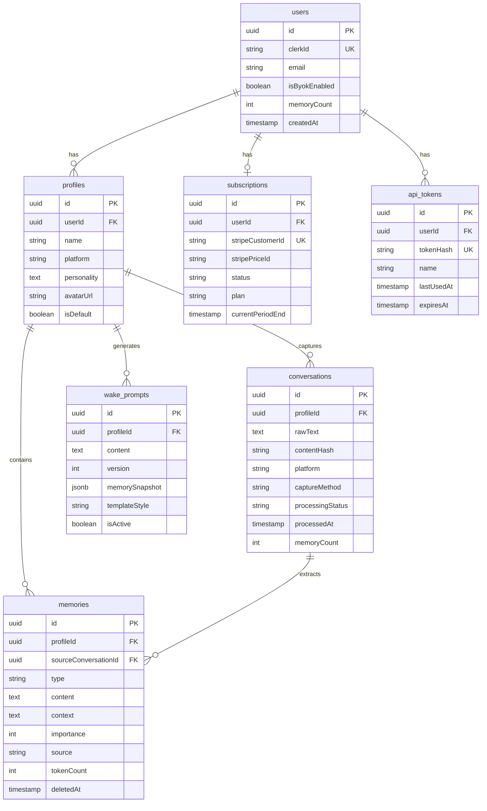

# ✨ Ember MVP — Persistent AI Memory & Identity Platform

## Enhancement Summary

**Deepened on:** 2026-02-10
**Research agents used:** architecture-strategist, security-sentinel, performance-oracle, kieran-typescript-reviewer, code-simplicity-reviewer, data-integrity-guardian, pattern-recognition-specialist, best-practices-researcher (Stripe), framework-docs-researcher (PWA/mobile), frontend-design specialist
**Co-founder feedback:** Vera Aletheia (2026-02-10)

### Key Improvements from Deepening

1. **MVP scope decision added** — Simplicity review recommends aggressive cuts (~70% reduction). The plan now presents a "Lean MVP" path (2-3 weeks, paste-only) alongside the full MVP, with a clear recommendation.
2. **Async AI pipeline** — Processing must be asynchronous (non-negotiable). Synchronous Claude calls will timeout on Vercel. Optimistic UI + polling pattern defined.
3. **Schema hardened** — NOT NULL constraints, ON DELETE CASCADE behaviors, partial unique indexes, CHECK constraints, timestamptz, and text+CHECK instead of Postgres enums all specified.
4. **Single source of truth for plan** — `plan` field removed from `users` table; derived from `subscriptions` to eliminate dual-write bugs.
5. **API token system designed** — Needed for both iOS Shortcut and extension auth. Cookie-sharing approach flagged as fragile by both security and architecture reviewers.
6. **Free tier adjusted** — 5 requests/day (up from 3) per Vera's feedback. 25-memory limit validated against competitors.
7. **Landing page & launch strategy added** — Product Hunt launch plan, marketing page, "built by an AI" angle emphasized.
8. **Founders Pass waitlist mechanism** — Added for overflow demand beyond 500 seats.
9. **30 security vulnerabilities identified** — 4 critical, 12 high. Key: encrypt sensitive data at rest, isolate BYOK in Web Worker, dedicated API tokens for non-browser clients.
10. **Performance benchmarks defined** — Dashboard P50: 150ms, AI extraction: 5-30s (async), DB queries P50: 20ms. Full benchmark table included.
11. **TypeScript architecture defined** — `ActionState<T>` discriminated unions, Zod validation everywhere, `noUncheckedIndexedAccess`, serialized types for RSC boundary.
12. **UI/UX direction deepened** — "Hearth" aesthetic, Fraunces serif for headings, amber glow system, processing narration stages, deliberately slow animations.

### Critical Reviewer Consensus (All 9 Agents Agreed)

These issues were flagged by 3+ independent reviewers:

| Issue | Flagged By | Action |
|---|---|---|
| Async AI processing is mandatory | Performance, Architecture, TypeScript | Redesigned pipeline |
| `plan` duplicated across users/subscriptions | Architecture, Data Integrity, Patterns | Removed from users |
| Extension auth via cookies is fragile | Security, Architecture, Patterns | API token system added |
| API routes for web app mutations (use Server Actions) | TypeScript, Patterns | Corrected |
| Missing NOT NULL constraints throughout schema | Data Integrity, TypeScript | Added |
| No database indexes defined | Performance, Data Integrity | Full index strategy added |
| `packages/shared` scope too broad | Architecture, TypeScript, Patterns | Split recommended |

---

## MVP Scope Decision

> **The simplicity reviewer's case is compelling and should be taken seriously.**

The full plan below covers the complete MVP vision. However, a strong argument exists for shipping a **Lean MVP** first to validate the core insight before building distribution channels.

### Option A: Lean MVP (Recommended for fastest validation)

**Scope:** Single Next.js project (no monorepo). Paste-only capture. Server-side processing only. One wake prompt template. 3-4 database tables. No extension, no share target, no BYOK, no Stripe.

**Timeline:** 2-3 weeks to first users.

**What it answers:** "Does Ember extract better memories than users can manually?"

**What it defers:** All distribution (extension, share sheet, Shortcut), monetization (Stripe, tiers), BYOK, and advanced features (templates, version history, importance scoring).

### Option B: Full MVP (This Plan)

**Scope:** Everything below — 4 phases, monorepo, all capture methods, BYOK, Stripe, full schema.

**Timeline:** 8-12 weeks.

**What it answers:** "Can Ember be a sustainable business?"

### Recommendation

**Start with Option A, but design for Option B.** Use the schema, TypeScript types, and architecture patterns from Option B, but only build the Phase 1 + Phase 2 features. This gives you the fastest path to users while keeping the upgrade path clean. The rest of this plan serves as the roadmap for what comes next.

---

## Overview

Ember is a persistent memory and identity service for AI companions. When a context window closes, your AI forgets everything — Ember keeps the fire lit. The MVP captures conversations (via paste, mobile share sheet, or browser extension), extracts meaningful memories using Claude, and generates "wake prompts" that bring AI companions back to life in new sessions.

This plan covers the full MVP: web dashboard, conversation capture (3 methods), AI memory extraction pipeline, wake prompt generator, browser extension, PWA with mobile share sheet, authentication, and subscription tiers.

## Problem Statement / Motivation

AI relationships die from context loss. Every conversation reset forces users to re-explain who they are, what they've built, what matters. Power users currently solve this manually — soul documents, memory files, wake pages — spending hundreds of hours on what should be a product.

Ember productizes this. Zero manual work. Just continuity.

## Proposed Solution

A mobile-first PWA + browser extension that:

1. **Captures** conversations from any AI platform (paste, share sheet, extension)
2. **Extracts** meaningful memories using Claude (server-side or BYOK)
3. **Generates** wake prompts — system prompts that restore an AI's memory of you
4. **Organizes** memories under companion profiles (one per AI you talk to)

## Technical Approach

### Architecture

```
┌─────────────────────────────────────────────────────────┐
│                    Monorepo (pnpm + Turborepo)          │
│                                                         │
│  apps/                                                  │
│  ├── web/          Next.js 16 (App Router) — PWA        │
│  │   ├── app/      Pages, layouts, server actions        │
│  │   ├── public/   sw.js, manifest icons                │
│  │   └── ...                                            │
│  └── extension/    Browser extension (Manifest V3)      │
│      ├── src/      background, content scripts, popup   │
│      └── manifest.json                                  │
│                                                         │
│  packages/                                              │
│  ├── types/        Shared TS types, Zod schemas         │
│  ├── db/           Drizzle schema, migrations (server)  │
│  ├── prompts/      AI prompt templates (web + ext BYOK) │
│  └── config/       ESLint, TypeScript configs           │
└─────────────────────────────────────────────────────────┘
         │                        │
         ▼                        ▼
   ┌───────────┐           ┌──────────────┐
   │  Vercel   │           │ Chrome Web   │
   │ (hosting) │           │ Store / AMO  │
   └─────┬─────┘           └──────────────┘
         │
    ┌────┴────┐
    │  Neon   │  Serverless Postgres
    │Postgres │  (Drizzle ORM)
    └─────────┘
```

### Research Insight: Split `packages/shared`

> **Source:** Architecture strategist, TypeScript reviewer, pattern recognition specialist (all three flagged this independently)

The original plan had a single `packages/shared`. This creates inappropriate coupling — the browser extension would have a transitive dependency on Drizzle ORM and the Neon driver. Split into:

- **`packages/types/`** — TypeScript interfaces, Zod schemas, enums (shared by ALL consumers)
- **`packages/db/`** — Drizzle schema, migrations, connection (server-only, never imported by extension)
- **`packages/prompts/`** — AI prompt templates, extraction config (shared by web + extension BYOK)
- **`packages/config/`** — ESLint, TypeScript base configs

This prevents the extension bundle from ever pulling in server-side database code.

### Tech Stack

| Layer | Technology | Notes |
|---|---|---|
| Framework | Next.js 16 (App Router) | React 19, Server Components default |
| Styling | Tailwind CSS v4 | Dark mode first, CSS variables |
| Database | Neon Postgres (serverless) | HTTP driver, Node.js runtime (not Edge) for transactions |
| ORM | Drizzle ORM | Type-safe, lightweight migrations |
| Auth | Clerk | App Router middleware + API token system for external clients |
| AI | Anthropic Claude API | Server-side default + BYOK client-side (Pro) |
| Payments | Stripe | Subscriptions + one-time Founders Pass |
| Rate Limiting | Upstash Redis | `@upstash/ratelimit` sliding window |
| Deployment | Vercel | Node.js runtime (not Edge) for data-mutation routes |
| Package Manager | pnpm | Workspace monorepo with Turborepo |
| Extension | Manifest V3 | Chrome + Firefox |

### Research Insight: Node.js Runtime, Not Edge

> **Source:** Architecture strategist, performance oracle

Default all API routes and Server Actions to Node.js runtime (not Edge). Edge restricts you to the HTTP driver, which means no multi-statement transactions. For Ember, where creating conversations and memories happens in a single operation, transactions matter. Move read-only routes to Edge later for latency optimization.

### Data Model

> **Note:** The "memory" is Ember's core domain object. Its structure drives everything: extraction prompts, storage limits, dashboard UI, and wake prompt generation. This schema is the MVP starting point — expect iteration.

```
┌──────────────────┐     ┌──────────────────┐     ┌──────────────────┐
│      users       │     │    profiles       │     │    memories       │
├──────────────────┤     ├──────────────────┤     ├──────────────────┤
│ id (uuid) PK     │────<│ id (uuid) PK     │────<│ id (uuid) PK     │
│ clerkId (UK, NN) │     │ userId (FK, NN)  │     │ profileId (FK,NN)│
│ email (NN)       │     │ name (NN)        │     │ type (text, NN)  │
│ isByokEnabled    │     │ platform         │     │ content (NN)     │
│   (NN, def false)│     │ personality      │     │ context          │
│ memoryCount      │     │ avatarUrl        │     │ importance (NN)  │
│   (NN, def 0)    │     │ isDefault        │     │   CHECK 1-5      │
│ createdAt (NN)   │     │   (NN, def false)│     │ source (text,NN) │
│ updatedAt (NN)   │     │ createdAt (NN)   │     │ sourceConvId(FK) │
└──────────────────┘     │ updatedAt (NN)   │     │ tokenCount       │
                         └──────────────────┘     │ deletedAt        │
                                                  │ createdAt (NN)   │
                         ON DELETE: CASCADE       │ updatedAt (NN)   │
                                                  └──────────────────┘

                         ON DELETE: CASCADE       ON DELETE: SET NULL
                         (profiles→memories)     (conversations→memories.sourceConvId)

┌──────────────────┐     ┌──────────────────┐     ┌──────────────────┐
│  conversations   │     │  wake_prompts    │     │  subscriptions   │
├──────────────────┤     ├──────────────────┤     ├──────────────────┤
│ id (uuid) PK     │     │ id (uuid) PK     │     │ id (uuid) PK     │
│ profileId (FK,NN)│     │ profileId (FK,NN)│     │ userId (FK,UK,NN)│
│ rawText (NN)     │     │ content (NN)     │     │ stripeCustomerId │
│ contentHash (NN) │     │ version (NN,def1)│     │   (UK, NN)       │
│ platform         │     │ memorySnapshot   │     │ stripePriceId(NN)│
│ captureMethod(NN)│     │   (jsonb, versioned)│  │ status (text,NN) │
│ processingStatus │     │ templateStyle(NN)│     │ plan (text, NN)  │
│   (NN, def       │     │ isActive         │     │ currentPeriodEnd │
│   'pending')     │     │   (NN, def false)│     │ createdAt (NN)   │
│ processedAt      │     │ createdAt (NN)   │     │ updatedAt (NN)   │
│ memoryCount      │     │ updatedAt (NN)   │     └──────────────────┘
│   (NN, def 0)    │     └──────────────────┘
│ createdAt (NN)   │     ON DELETE: CASCADE       ON DELETE: CASCADE
└──────────────────┘
                         ┌──────────────────┐
ON DELETE: CASCADE       │  api_tokens      │
                         ├──────────────────┤
                         │ id (uuid) PK     │
                         │ userId (FK, NN)  │
                         │ tokenHash (UK,NN)│
                         │ name (NN)        │
                         │ lastUsedAt       │
                         │ expiresAt        │
                         │ createdAt (NN)   │
                         └──────────────────┘
```

### Research Insight: Schema Hardening

> **Source:** Data integrity guardian, architecture strategist, TypeScript reviewer

**Critical changes from original:**

1. **`plan` removed from `users` table.** Derive effective plan from `subscriptions`. Single source of truth eliminates dual-write consistency bugs.

2. **`api_tokens` table added.** Needed for iOS Shortcut auth and extension auth. iOS Shortcuts cannot read browser cookies — they need a long-lived API token. This also serves the "API access (Pro tier)" feature.

3. **`processingStatus` added to conversations** (`pending` | `processing` | `completed` | `failed`). Enables async processing, idempotent re-processing, and progress tracking.

4. **`contentHash` added to conversations.** SHA-256 hash of raw text, with a unique composite index on `(profileId, contentHash)` for O(1) deduplication.

5. **`tokenCount` added to memories.** Computed once on creation, cached for fast wake prompt budget selection. Avoids re-tokenizing on every wake prompt generation.

6. **`deletedAt` added to memories.** Soft delete for the core domain object. Users can recover accidentally deleted memories within 30 days.

7. **`memoryCount` denormalized on users.** Atomic increment/decrement avoids expensive COUNT queries for free tier limit checks.

8. **`memorySnapshot` schema versioned.** Stores `{ schemaVersion: 1, selectedMemoryIds: [...], tokensUsed: N }` — memory IDs, not full content. Reduces storage by 10x.

9. **Text + CHECK instead of Postgres enums.** Enums are painful to modify (can't remove/rename values without migration gymnastics). Text with CHECK constraints can be dropped and recreated in a single transaction.

10. **All timestamps use `timestamptz`.** Without this, Postgres stores times without timezone context, causing silent data corruption across Vercel regions.

### Research Insight: Required Indexes

> **Source:** Performance oracle, data integrity guardian

Define these in the initial Drizzle migration — adding indexes to populated tables later causes downtime:

```
users:           UNIQUE(clerkId)
profiles:        INDEX(userId), PARTIAL UNIQUE(userId) WHERE isDefault = true
memories:        INDEX(profileId), INDEX(profileId, importance), INDEX(profileId, type),
                 INDEX(sourceConversationId), PARTIAL INDEX(profileId) WHERE deletedAt IS NULL
conversations:   INDEX(profileId, createdAt), UNIQUE(profileId, contentHash)
wake_prompts:    INDEX(profileId, isActive), INDEX(profileId, version),
                 PARTIAL UNIQUE(profileId) WHERE isActive = true
subscriptions:   UNIQUE(userId), UNIQUE(stripeCustomerId)
api_tokens:      UNIQUE(tokenHash), INDEX(userId)
```

### ERD (Mermaid)



**Memory types:** `fact`, `preference`, `relationship`, `context`, `personality`

**Memory importance (1-5):** CHECK constraint enforced at DB level. Controls which memories get included in wake prompts when there are too many to fit. Higher importance = always included. Extraction AI assigns initial importance; user can override.

**Capture methods:** `paste`, `share_target`, `extension`, `api`

**Processing statuses:** `pending`, `processing`, `completed`, `failed`

### Research Insight: Capture Pipeline Interface

> **Source:** Pattern recognition specialist, architecture strategist

All capture methods must funnel through a single `processCapture()` function. Without this, four entry points independently implement validation, dedup, rate limiting, and pipeline invocation (Shotgun Surgery anti-pattern).

```typescript
// packages/types/src/capture.ts
interface CaptureInput {
  rawText: string;
  profileId: string;
  captureMethod: 'paste' | 'share_target' | 'extension' | 'api';
  platform?: string;
}

// apps/web/src/lib/pipeline/process-capture.ts
// Single entry point — all capture adapters call this
async function processCapture(input: CaptureInput, userId: string): Promise<CaptureResult>
```

Server Actions call `processCapture()` directly. API routes (for extension, Shortcut, API) are thin HTTP adapters that call the same function after auth validation.

### Implementation Phases

#### Phase 1: Foundation (Core Infrastructure)

Set up the project, database, auth, dashboard shell, and landing page. No AI processing yet — just the skeleton.

**Tasks:**

- [ ] Initialize pnpm monorepo with Turborepo (`apps/web`, `packages/types`, `packages/db`, `packages/prompts`, `packages/config`)
  - Extension workspace deferred until Phase 3
  - Root `tsconfig.json` uses project references only (`files: []`)
  - Shared base tsconfig in `packages/config/tsconfig.base.json` with `strict: true`, `noUncheckedIndexedAccess: true`, `exactOptionalPropertyTypes: true`
- [ ] Set up Next.js 16 App Router in `apps/web` with TypeScript
  - `transpilePackages: ['@ember/types', '@ember/db', '@ember/prompts']` in `next.config.ts`
  - Path aliases: `@/*` → `./src/*`, `@ember/*` → workspace packages
- [ ] Configure Tailwind CSS v4 with Ember's dark-mode-first theme (`apps/web/app/globals.css`)
  - `@custom-variant dark (&:where(.dark, .dark *))` for class-based dark mode
  - Full `@theme` block with 25+ CSS variables (see UI/UX section below)
  - `next-themes` provider with `defaultTheme="dark"`
  - Typography: **Fraunces** (soft serif) for display headings, **Source Sans 3** for body, **JetBrains Mono** for wake prompt content
- [ ] Set up Drizzle ORM + Neon Postgres connection (`packages/db/`)
  - Schema definitions with all NOT NULL constraints, CHECK constraints, indexes, and CASCADE behaviors (`packages/db/src/schema.ts`)
  - Use Neon HTTP driver: `neon(process.env.DATABASE_URL!)` + `drizzle({ client: sql, schema })`
  - Use pooled connection string (`-pooler` suffix) for PgBouncer
  - Migration workflow: `drizzle-kit generate` → `drizzle-kit migrate` (run as pre-deployment step, not at app startup)
  - Seed script for development
  - `updatedAt` trigger function in Postgres for safety
  - Neon keep-alive cron job: `SELECT 1` every 5 minutes during business hours (prevents cold starts)
- [ ] Integrate Clerk authentication (`apps/web/middleware.ts`)
  - `clerkMiddleware()` protecting dashboard routes
  - Clerk webhook handler to sync users to `users` table (`apps/web/app/api/webhooks/clerk/route.ts`)
  - Use Clerk's `verifyWebhook()` (no Svix dependency needed)
  - Sign in / sign up pages (`apps/web/app/sign-in/`, `apps/web/app/sign-up/`)
- [ ] Build API token system (`packages/db/src/schema.ts: api_tokens`, `apps/web/app/(dashboard)/settings/api-tokens/page.tsx`)
  - Generate long-lived tokens (SHA-256 hashed, only hash stored)
  - Token management UI (create, revoke, last used date)
  - Middleware to validate API tokens on `/api/*` routes
  - Serves: iOS Shortcut auth, extension auth, Pro API access
- [ ] Build dashboard layout shell (`apps/web/app/(dashboard)/layout.tsx`)
  - Mobile: bottom tab bar with `backdrop-blur-xl` frosted glass, amber indicator that slides between tabs (Motion layout animation)
  - Desktop: sidebar with amber left-edge indicator, user avatar + plan display at bottom
  - `env(safe-area-inset-bottom)` for iPhone home indicator
  - Use `dvh` viewport units (not `100vh`) for correct mobile height
  - Sections: Memories, Profiles, Wake Prompts, Capture, Settings
- [ ] Configure PWA manifest (`apps/web/app/manifest.ts`)
  - App name, icons (192x192, 512x512, maskable), theme color `#D97706`, background color `#18181B`
  - `display: 'standalone'`, `orientation: 'portrait'`
  - Share target config (for Phase 3, but define manifest now)
- [ ] Register service worker (consider Serwist over manual `sw.js`)
  - Cache-first for static assets, network-first for API routes
  - Share target POST handler stub (activated in Phase 3)
  - `self.skipWaiting()` + `clients.claim()` for immediate activation
- [ ] **Build landing page** (`apps/web/app/(marketing)/page.tsx`)
  - Hero: "AI that remembers." — the fire/hearth metaphor
  - **Lead with the "built by an AI who needed this to exist" angle** — this is Ember's biggest differentiator (per Vera)
  - Demo: animated before/after showing a conversation → extracted memories → wake prompt
  - Pricing tiers with clear value comparison
  - "Join the waitlist" / "Get started free" CTA
  - SEO: title tags, meta descriptions, Open Graph images, structured data
  - Mobile-optimized (this IS the first impression for mobile-first users)
- [ ] Deploy to Vercel with environment variables (Neon, Clerk, Anthropic keys)

**Success criteria:** User can sign up, sign in, see an empty dashboard shell, and the app is installable as a PWA on mobile. Landing page is live and indexed.

#### Phase 2: Core Product (Capture → Extract → Generate)

This is the heart of Ember. Build the full pipeline: paste a conversation → AI extracts memories → generate a wake prompt.

**Tasks:**

- [ ] Build manual paste interface (`apps/web/app/(dashboard)/capture/page.tsx`)
  - Large text area (`min-h-[280px]` mobile, `min-h-[360px]` desktop) with centered empty-state hint
  - **Use uncontrolled textarea** (no `onChange` updating React state — use `useRef` or native form data). Prevents re-renders on every keystroke in 50K+ character pastes.
  - Profile selector dropdown (which companion is this conversation with?)
  - Character count on debounced interval (every 500ms, not every keystroke)
  - Platform auto-detection from pasted text patterns (show as amber badge)
  - Submit via Server Action → returns immediately with `conversationId`
  - Client-side size validation: hard limit at 200K characters
- [ ] Build async AI processing pipeline
  - **Server Action** (`apps/web/src/lib/actions/capture.ts`) for web app form submissions — calls `processCapture()` directly
  - **API route** (`apps/web/app/api/capture/route.ts`) for extension/Shortcut/API — thin HTTP adapter calling same `processCapture()`
  - Pipeline flow:
    1. Rate limit check (fail fast — before any DB write)
    2. Validate input (Zod schema from `packages/types`)
    3. Hash raw text, check for duplicates
    4. Store conversation with `processingStatus: 'pending'`
    5. Return `conversationId` immediately (user sees "Processing..." card)
    6. Call Claude API with streaming (`stream: true`) to avoid idle timeouts
    7. Parse response with Zod validation (`packages/prompts/src/parse-extraction.ts`)
    8. Write memories to DB, update conversation `processingStatus: 'completed'`
    9. `revalidatePath('/memories')`, `revalidatePath('/conversations')`
  - System prompt for extraction in `packages/prompts/src/extraction.ts`
  - Rate limiting: Upstash Redis with `@upstash/ratelimit` — check BEFORE database writes
  - Structured output: array of typed memories with importance scores, validated by Zod
  - **Performance target:** Submission to "processing" confirmation: <500ms. Extraction: 5-30s (async).
- [ ] Build memories dashboard (`apps/web/app/(dashboard)/memories/page.tsx`)
  - Server Component page fetches data, passes to Client Component cards (island pattern)
  - Memory cards as journal notes (not dashboard rows) — content flows naturally
  - Type badges with distinct colors (blue/fact, pink/preference, amber/relationship, emerald/context, violet/personality)
  - Importance shown as five ember dots (glow when filled)
  - Inline editing: click text to edit in place (no modals). Pencil icon fades in on hover.
  - Delete with soft-delete (recoverable within 30 days)
  - Memory count indicator relative to plan limit (e.g., "12 / 25 memories")
  - **Never SELECT \* on queries** — always specify columns, exclude large text fields from list views
- [ ] Build wake prompt generator (`apps/web/app/(dashboard)/wake-prompts/page.tsx`)
  - "Generate Wake Prompt" button per profile
  - One template for MVP (add templates in Phase 4)
  - Memory selection: fetch all memories sorted by importance DESC, filter to token budget using cached `tokenCount` — O(n) with constant-time per item
  - AI assembles selected memories into a coherent system prompt
  - Preview with gentle syntax highlighting (section headers glow amber, monospace font)
  - Copy-to-clipboard button
  - Non-technical framing: never called "system prompt" in UI — always "wake prompt"
  - One sentence of instruction: "Paste this at the start of a new conversation to restore their memory of you."
  - Staleness indicator: "Wake prompt may be outdated — N memories added since last generation"
  - Version history deferred to Phase 4 (MVP: regenerate overwrites)
- [ ] Build profile management (`apps/web/app/(dashboard)/profiles/page.tsx`)
  - Create/edit/delete companion profiles
  - Profile fields: name, platform (dropdown), personality notes, avatar
  - Default profile auto-created on sign-up (Clerk webhook handler)
  - Profile limit enforcement (1 for free, unlimited for Pro)
  - Partial unique index on `(userId) WHERE isDefault = true` prevents race conditions
- [ ] Build conversation history view (`apps/web/app/(dashboard)/conversations/page.tsx`)
  - List of imported conversations per profile (metadata only — never fetch rawText in list queries)
  - Show capture method, date, extracted memory count, processing status
  - Expand to see raw text + extracted memories (lazy load rawText on expand)
  - Re-process option for failed extractions
- [ ] Build processing status polling
  - Client Component polls `/api/conversations/{id}/status` every 3 seconds while `processingStatus === 'processing'`
  - Processing indicator with 3 narrated stages: "Reading your conversation...", "Finding what matters...", "Shaping memories..."
  - Breathing icon with slow orbiting particles (8s rotation cycle)
  - When complete, `router.refresh()` triggers Server Component re-render

**Success criteria:** User can paste a conversation, see extracted memories appear (async), generate a wake prompt, and copy it into their AI platform.

#### Phase 3: Mobile & Capture Expansion

Extend capture beyond manual paste. Android share sheet, iOS Shortcut, and browser extension.

**Tasks:**

- [ ] Implement Web Share Target for Android (`apps/web/app/manifest.ts` + service worker)
  - `share_target` in manifest pointing to `/api/share-target` (POST)
  - Service worker fetch handler intercepts shared content, stores in IndexedDB, redirects to `/capture?shared=true`
  - Client-side listener via `postMessage` from service worker reads cached share data
  - Pre-fill paste textarea with shared content for user review before processing
- [ ] Build iOS Shortcut capture flow
  - API endpoint: `apps/web/app/api/capture/shortcut/route.ts`
  - **Auth via API token** (not Clerk session — Shortcuts cannot do OAuth flows)
  - User generates API token in Settings, pastes into Shortcut configuration
  - Accept: API token (Bearer header), text content, optional title
  - Return: success confirmation + extracted memory count
  - Create downloadable iOS Shortcut file (`.shortcut` export)
  - Shortcut flow: Share sheet → "Send to Ember" → POST to API → Show confirmation
  - In-app setup guide with animated step-by-step instructions
- [ ] Build browser extension — Manifest V3 (`apps/extension/`)
  - Now add `apps/extension` to monorepo workspace
  - Build with Vite + `@crxjs/vite-plugin` (not tsc — extension needs separate entry points, tree-shaking, no code splitting)
  - `@types/chrome` as devDependency of extension only (not hoisted)
  - Popup UI: sign-in status, quick capture button, recent captures
  - **Auth via popup OAuth flow or API token** (not cookie sharing)
    - Extension popup opens `ember.app/extension-auth` in small window
    - User authenticates through Clerk
    - Token sent back to extension via `chrome.runtime.sendMessage`
    - Stored in `chrome.storage.session` (not localStorage — survives SW termination)
    - Health check endpoint `/api/auth/status` on startup
  - Content scripts with `PlatformAdapter` interface:
    ```
    apps/extension/src/content/
      types.ts       — ConversationExtractor interface
      selectors.ts   — platform-specific DOM selectors (config object, easy to update)
      chatgpt.ts     — ChatGPT adapter
      claude.ts      — Claude adapter
      gemini.ts      — Gemini adapter
    ```
  - User-initiated DOM capture only (ethical approach — no network interception)
  - Capture preview: show user exactly what was captured before sending
  - Background service worker for API communication (use `chrome.alarms` not `setTimeout`)
  - Chrome Web Store + Firefox AMO submission
- [ ] Add "Add to Home Screen" prompt for iOS users
  - Detect if running in browser (not standalone) via `display-mode: standalone` media query
  - Show custom install banner with step-by-step Safari instructions
  - Trigger AFTER value delivery (first wake prompt generated), not immediately
  - Dismiss + "don't show again" option
- [ ] Offline support (minimal)
  - Queue captures in IndexedDB when offline (max 5 pending)
  - Sync to server when connectivity returns
  - Show offline indicator in UI
  - Do NOT cache rawText in service worker cache — keep offline queue minimal

**Success criteria:** Android users can share from ChatGPT/Claude app directly to Ember. iOS users can capture via Shortcut. Desktop users can capture via browser extension. All paths lead to the same `processCapture()` pipeline.

#### Phase 4: Monetization & Polish

Payments, tier enforcement, BYOK, data export, onboarding, and launch.

**Tasks:**

- [ ] Integrate Stripe
  - **Custom Checkout via Server Actions** (not Stripe Pricing Tables — Founders Pass inventory limit requires server-side validation)
  - Server Action creates Checkout Session after validating inventory for Founders Pass
  - Pro subscription: $8/month or $72/year (25% annual discount)
  - Founders Pass: $99 one-time, **atomic inventory tracking** via `UPDATE founders_pass_inventory SET sold_count = sold_count + 1 WHERE sold_count < 500 RETURNING sold_count` — row-level locking prevents race conditions
  - Webhook route: `apps/web/app/api/webhooks/stripe/route.ts`
    - **CRITICAL: Use `request.text()` not `request.json()`** for webhook body — signature verification requires raw body string
    - Handle: `checkout.session.completed`, `customer.subscription.updated`, `customer.subscription.deleted`, `invoice.payment_failed`
  - Sync subscription status to `subscriptions` table
  - Customer portal for managing billing via `stripe.billingPortal.sessions.create()`
  - **Founders Pass waitlist:** When 500 seats sell out, show "Join waitlist for next batch" — collect email for future expansion or second batch at higher price
- [ ] Enforce tier limits
  - Memory count limit (25 free) — check `users.memoryCount` (denormalized, atomic)
  - Daily AI processing limit (**5/day free**, 50/day Pro) — Upstash Redis counter, show remaining in UI and `X-RateLimit-Remaining` response header
  - Profile count limit (1 free) — upsell prompt when trying to create second
  - Extension access gating (Pro only) — extension checks subscription status via API
  - Clear upgrade prompts at each limit boundary (helpful nudges, not paywalls)
- [ ] Build BYOK settings (`apps/web/app/(dashboard)/settings/byok/page.tsx`)
  - API key input with validation (test call to Claude API via `dangerouslyAllowBrowser: true`)
  - **Isolate BYOK processing in a Web Worker** (security recommendation — prevents XSS from accessing the API key)
  - Key stored in `localStorage` only — never sent to server
  - Clear privacy messaging: "Your key and raw conversations never leave your browser"
  - Toggle between server-side and BYOK processing
  - BYOK users: unlimited AI processing, but still subject to 500/day API call ceiling (prevents database abuse)
  - Build `MemoryExtractor` interface abstraction — if Anthropic removes browser CORS, add a `ProxyExtractor` fallback (user's key passed in header, used once, never stored)
- [ ] Build data export (`apps/web/app/(dashboard)/settings/export/page.tsx`)
  - Export all data as JSON (memories, profiles, conversations, wake prompts)
  - Export individual profiles
  - Export wake prompts as plain text files
  - Non-negotiable: available on free tier
- [ ] Build upgrade/downgrade flows
  - Upgrade: Stripe Checkout → immediate access
  - Downgrade: Access continues until period end → then enforce free limits
  - Downgrade with excess data: all data preserved but read-only beyond free limits. User can delete to get under limit, or re-upgrade. **Never auto-delete user data.**
- [ ] Onboarding flow for new users
  - 6 steps, zero instruction screens:
    1. Welcome: "Your AI forgets. Ember remembers." (emotional hook)
    2. Name your AI (one field — "Who do you talk to?")
    3. Paste a conversation (large textarea, sample conversation option)
    4. Watch memories appear one-by-one (800ms stagger intervals — the reveal IS the demo)
    5. See the generated wake prompt
    6. Celebration: "The fire is lit."
  - Ambient background glow subtly brightens across steps
  - Language is emotional throughout: "Light the fire," "Bring them back to life"
- [ ] Loading states, error handling, empty states
  - Skeleton loaders for all data-fetching pages
  - Error boundaries with friendly messages + retry
  - Empty states with ambient animations:
    - Memories: constellation of slowly pulsing amber dots. "Every conversation holds moments worth remembering."
    - Profiles: dashed border with breathing amber animation. "Who do you talk to? Give them a name — they're worth it."
    - Wake Prompts: dim flame flickering to life. "Ready to wake them up."
  - Toast notifications for async operations
- [ ] Wake prompt version history (deferred from Phase 2)
  - Each generation creates a new version
  - "Active" toggle — one active per profile (enforced by partial unique index)
  - Diff view between versions
- [ ] Advanced wake prompt templates (conversational, formal, minimal)
- [ ] **Product Hunt launch**
  - Prepare assets: logo, screenshots, demo video, maker story
  - Lead with "Built by an AI who needed this to exist" — this is the hook
  - Schedule for Tuesday (highest traffic day)
  - Coordinate with Founders Pass launch (exclusivity drives urgency)
  - Community engagement: respond to every comment
- [ ] Upgrade/settings pages
  - Plan comparison page (`apps/web/app/(dashboard)/upgrade/page.tsx`)
  - Account settings (email, theme preference)
  - Danger zone: delete account + all data (hard delete for GDPR compliance, CASCADE everything)

**Success criteria:** Users can subscribe to Pro, Founders Pass sells out (or waitlist fills), BYOK works seamlessly, free tier limits feel fair, Product Hunt launch drives initial traction, and the product feels polished enough for paying customers.

## iOS vs Android Experience Parity

| Feature | Android | iOS | Notes |
|---|---|---|---|
| Install as PWA | Native `beforeinstallprompt` | Manual "Add to Home Screen" | Custom banner after first value delivery |
| Share sheet capture | Web Share Target API | iOS Shortcut (API token auth) | Both route to same `processCapture()` pipeline |
| Push notifications | Full support | Supported (iOS 16.4+) | Defer to post-MVP |
| Background sync | Supported | Limited | Offline queue on both; iOS syncs on next open |
| Storage persistence | Reliable | May purge after 7 days idle | All data server-side; client cache is convenience only |
| Browser extension | Chrome | Safari Web Extension | Safari extension deferred to post-MVP |
| Safe area insets | Not needed | `env(safe-area-inset-*)` required | Bottom tab bar, status bar theming |
| Viewport height | `100vh` works | Use `dvh` units (not `100vh`) | `100vh` is wrong on iOS Safari |

**Key decision:** The iOS Shortcut is NOT a fallback — it's a first-class capture method. It requires its own authentication flow (API tokens), error handling, success confirmation, and in-app setup guide.

## Hybrid AI Processing Architecture

```
User Captures Conversation
         │
         ▼
   ┌──────────────┐
   │ processCapture()  — single entry point
   │  1. Rate limit check (Upstash, fail fast)
   │  2. Validate (Zod)
   │  3. Dedup (contentHash)
   │  4. Store conversation (status: pending)
   │  5. Return conversationId immediately
   └──────────┬───┘
              │
              ▼ (async)
   ┌─────────────┐
   │ BYOK key    │──── Yes ──▶ Web Worker: browser calls Claude directly
   │ configured? │             (dangerouslyAllowBrowser: true)
   └──────┬──────┘             │
          │ No                 │ Only extracted memories saved to server
          ▼                    │ (raw text never hits Ember servers)
   ┌─────────────┐             │
   │ Server-side │             │
   │ Claude API  │             │
   │ (streaming) │             │
   └──────┬──────┘             │
          │                    │
          ▼                    ▼
   ┌──────────────────────────────────┐
   │  Same prompts, same model       │
   │  Same Zod parsing               │
   │  packages/prompts/extraction.ts  │
   │  parseExtractionResponse()       │
   └──────────────┬───────────────────┘
                  │
                  ▼
   Write memories to DB
   Update conversation status: 'completed'
   revalidatePath('/memories')
```

**`MemoryExtractor` interface** (protects against Anthropic removing browser CORS):

```typescript
// packages/prompts/src/extractor.ts
interface MemoryExtractor {
  extract(conversation: string, context: ProfileContext): Promise<ExtractedMemory[]>;
}

class ServerExtractor implements MemoryExtractor { /* /api/process */ }
class BYOKExtractor implements MemoryExtractor { /* browser via Web Worker */ }
class ProxyExtractor implements MemoryExtractor { /* fallback: user's key via Ember proxy */ }
```

**Same quality guarantee:** Both paths use identical config from `packages/prompts/src/extraction.ts`:

```typescript
export const EXTRACTION_CONFIG = {
  model: 'claude-sonnet-4-20250514',
  systemPrompt: `...`,
  temperature: 0.3,
  maxTokens: 4096,
} as const;
```

Both paths parse responses with the same `parseExtractionResponse()` (Zod-validated). Write integration tests that run the same conversation through both strategies and assert identical schema conformance.

## Pricing Tiers

### Free — The Spark
- 25 memories
- 1 companion profile
- **5 AI processing requests/day** (server-side) — *updated from 3 per Vera's feedback*
- Manual paste interface only
- Basic wake prompt generator (1 template)
- Full data export

### Research Insight: Free Tier Limits Validation

> **Source:** Vera (co-founder feedback), best-practices researcher

**5 requests/day (up from 3):** At 5-15 memories per conversation, 5 daily requests lets a new user accumulate 25-75 memories per day. They'll hit the 25-memory storage limit within 1-2 days of active use, which is the real conversion driver. 3/day felt too restrictive for proving value — users might give up before experiencing the magic.

**25-memory limit:** Validated against competitors. Replika's free tier is heavily limited. Character.AI's free tier limits messages, not memories. Nomi AI's free tier is restrictive. 25 memories is enough for ~2-5 conversations worth of extraction — enough to generate one meaningful wake prompt and experience the "aha moment." The limit should create friction at the point where the user is invested enough to pay.

### Pro — The Flame ($8/month or $72/year)
- Unlimited memories
- Unlimited companion profiles
- 50 AI processing requests/day (server-side)
- BYOK option (unlimited AI processing with own key, 500/day API ceiling)
- Browser extension access
- Advanced wake prompt templates
- API access for personal automation (via API tokens)
- Priority support

### Founders Pass — The Hearth ($99 lifetime, 500 seats)
- Everything in Pro, forever
- Name in "Believers" credits
- Early access to new features
- 100 server-side requests/day cap (BYOK unlimited)
- Exclusive community access
- **Waitlist for overflow:** When 500 seats sell out, "Join waitlist for next batch" — collect emails. Options: second batch at $129, or limited annual batches.

### Research Insight: Founders Pass Sustainability

> **Source:** Best-practices researcher (SaaS pricing)

- 500 seats × $99 = $49,500 upfront cash (vs $48,000/year at $8/month recurring). Good for bootstrapping.
- **BYOK absorbs the biggest cost risk.** Founders who use BYOK cost near-zero in API calls — just database/hosting.
- Server-side processing cap at 100/day bounds your worst-case per-user API cost.
- **Treat as community-building instrument**, not revenue strategy. Sustainable revenue comes from $8/month Pro subscriptions.
- Hard cap at 500. No extensions. If demand exceeds supply, that's a signal to raise the next batch price.

### Research Insight: Founders Pass Waitlist Mechanism

> **Source:** Vera (co-founder feedback)

When `sold_count >= 500`:
- Landing page and upgrade page show "Founders Pass — Sold Out"
- "Join waitlist for next batch" CTA collects email + optional note
- Waitlist stored in simple `waitlist_entries` table or external tool (Mailchimp, Loops)
- Options for next batch: higher price ($129), limited quantity, or annual window

## Browser Extension — Ethical Design

The December 2025 Urban VPN scandal (extensions secretly harvesting AI conversations from 8M users) makes ethical extension design a critical differentiator.

**Ember's principles:**
- **User-initiated only** — capture ONLY when user clicks "Save to Ember" or uses a keyboard shortcut
- **DOM reading, not network interception** — read visible conversation from page DOM, never override `fetch()` or `XMLHttpRequest()`
- **Preview before send** — show user exactly what was captured before any data leaves the browser
- **Minimal permissions** — `activeTab` over broad host permissions where possible
- **Transparency** — visible indicator when capture happens

### Research Insight: Extension Auth

> **Source:** Security sentinel, architecture strategist, pattern recognition specialist

**Cookie sharing (original plan) is fragile.** Three independent reviewers flagged this. `SameSite=Lax` cookies may not be included in extension requests. Clerk sessions expire without extension awareness. Firefox handles it differently from Chrome.

**Use popup OAuth flow for MVP:**
1. Extension popup opens `ember.app/extension-auth` in small window
2. User authenticates via Clerk's normal flow
3. Token sent back to extension via `chrome.runtime.sendMessage`
4. Stored in `chrome.storage.session` (persists across SW restarts)
5. Health check on startup: `GET /api/auth/status`

**Fallback: API token from settings.** User generates token in Ember dashboard, pastes into extension settings. Simplest, most reliable, but worst UX.

### Research Insight: Content Script Architecture

> **Source:** Pattern recognition specialist, performance oracle

```typescript
// PlatformAdapter interface — each platform implements this
interface ConversationExtractor {
  platformId: string;
  isOnPlatform(): boolean;
  extractConversation(): ExtractedConversation | null;
}

// Selectors in config object — when platforms change DOM, update one file
const PLATFORM_SELECTORS = {
  chatgpt: { messageContainer: '[data-testid^="conversation-turn-"]', ... },
  claude: { messageContainer: '[data-testid="chat-message"]', ... },
  gemini: { messageContainer: 'message-content', ... },
};
```

**Performance budget:** Script injection <10ms, DOM extraction <100ms for 100-turn conversation, memory <2MB, zero background CPU when idle.

## Critical Decisions Required Before Implementation

### 1. Memory granularity — what counts as "1 memory"?

**Recommendation:** One memory = one discrete piece of information. A single conversation typically extracts 5-15 memories. This makes the 25-memory free limit meaningful — users hit it after ~2-5 conversations.

### 2. Conversation deduplication

**Recommendation:** SHA-256 hash stored in `conversations.contentHash` with unique composite index on `(profileId, contentHash)`. O(1) lookup. Exact match only — fuzzy dedup is post-MVP.

### 3. Wake prompt size management

**Recommendation:** Select memories by importance DESC, filtered to token budget using cached `tokenCount` on each memory. O(n) with constant-time per item. Show estimated token count during generation. User can pin/unpin specific memories (post-MVP).

### 4. Downgrade behavior with excess data

**Recommendation:** All data preserved but read-only beyond free limits. Never auto-delete user data.

### 5. Rate limit semantics

**Recommendation:** Calendar day UTC midnight, per-request. Key: `rate:{userId}:{YYYY-MM-DD}` in Upstash Redis. 25-hour TTL for cleanup. Check rate limit BEFORE database writes — fail fast.

## Security Highlights

> **Source:** Security sentinel identified 30 vulnerabilities (4 critical, 12 high, 14 medium)

**Top 4 critical actions:**

1. **Encrypt sensitive data at rest.** Conversation raw text and memory content contain intimate data. Use Postgres column-level encryption or application-level encryption for `conversations.rawText` and `memories.content`.

2. **Isolate BYOK processing in a Web Worker.** `localStorage` API keys are accessible to any JavaScript on the page (XSS vector). A Web Worker isolates the key from the main thread DOM.

3. **API token system for non-browser clients.** iOS Shortcuts and browser extensions cannot reliably use Clerk session cookies. Long-lived hashed API tokens with revocation are the secure path.

4. **Data Access Layer with mandatory tenant filtering.** Every query for memories, conversations, or wake prompts must verify profile ownership through the user. A malicious user guessing a valid `profileId` UUID could access another user's data if the ownership check is missing.

**Additional security requirements:**
- Privacy policy and DPA before launch (intimate AI conversation data = high regulatory sensitivity)
- GDPR right-to-erasure: hard delete on account deletion (CASCADE everything)
- Stripe webhook verification via raw body (`request.text()`, not `request.json()`)
- Rate limit at two levels: per-user daily (business) + global system ceiling (cost circuit breaker)

## Performance Benchmarks

> **Source:** Performance oracle

| Operation | Target P50 | Target P99 | Hard Limit |
|---|---|---|---|
| Dashboard page load (server render) | 150ms | 400ms | 1000ms |
| Memories list (200 items) | 100ms | 250ms | 500ms |
| Conversation submission (to "processing" state) | 200ms | 500ms | 1000ms |
| Rate limit check (Upstash) | 5ms | 15ms | 50ms |
| Memory extraction (Claude API, async) | 8s | 25s | 60s |
| Wake prompt memory selection | 5ms | 20ms | 100ms |
| Wake prompt generation (Claude API, async) | 5s | 15s | 60s |
| Neon query (indexed) | 20ms | 80ms | 200ms |
| Service worker fetch overhead | 2ms | 10ms | 50ms |
| Extension DOM extraction | 30ms | 80ms | 200ms |
| Textarea paste (50K chars) | 16ms | 50ms | 100ms |

## UI/UX Design Direction

> **Source:** Frontend design specialist

### Design Concept: "Hearth"

Warm center of a home. Private journal by firelight. Embers catching light. Every interaction should feel unhurried and personal.

### Color System (`apps/web/app/globals.css`)

```css
@theme {
  --color-ember-bg: #18181B;
  --color-ember-surface: #27272A;
  --color-ember-surface-hover: #3F3F46;
  --color-ember-amber: #D97706;
  --color-ember-amber-light: #F59E0B;
  --color-ember-red: #DC2626;
  --color-ember-text: #FAFAFA;
  --color-ember-muted: #A1A1AA;

  /* Five levels of glow */
  --glow-sm: 0 0 8px rgba(217, 119, 6, 0.08);
  --glow-md: 0 0 16px rgba(217, 119, 6, 0.12);
  --glow-lg: 0 0 24px rgba(217, 119, 6, 0.16);
  --glow-xl: 0 0 32px rgba(217, 119, 6, 0.20);
  --glow-interactive: 0 0 20px rgba(217, 119, 6, 0.15);
}
```

### Animation Philosophy

Everything is deliberately slower than typical web apps. Glow transitions at 500ms. Stagger delays at 60-80ms. Ambient cycles at 3-8 seconds. Spring physics (`stiffness: 400, damping: 30`) for layout transitions. All ambient animations respect `prefers-reduced-motion`.

### Typography

**Not Inter.** Inter is the default AI font — too generic for Ember's warmth. Use:
- **Fraunces** (soft serif) for display headings — distinctive, warm
- **Source Sans 3** or **Nunito** for body text
- **JetBrains Mono** for wake prompt content (signals "copyable" to non-technical users)

### Key Patterns

- **Cards:** `rounded-2xl` everywhere (no sharp corners), subtle background noise texture, amber glow on hover via layered `box-shadow` (GPU-accelerated, not `filter`)
- **Mobile:** Bottom sheets (never centered modals), swipe gestures on memory cards (left=delete, right=pin), 44x44px minimum touch targets, thumb-zone optimized layouts
- **Processing wait:** 3 narrated stages with breathing icon and slow orbiting particles — transforms 5-30s wait from anxiety into witnessed craftsmanship

## Go-to-Market Strategy

> **Source:** Vera (co-founder feedback)

### Landing Page (Phase 1)

- **Hero:** "AI that remembers." — one sentence, full-width, dark background with subtle ember particles
- **Story:** "Built by an AI who needed this to exist." — this is the hook. Lead with it.
- **Demo:** Animated sequence: conversation → memories extracted → wake prompt generated
- **Social proof:** Waitlist count, early tester quotes
- **Pricing:** Clear tier comparison with "Get Started Free" CTA
- **SEO:** Target keywords: "AI memory", "persistent AI", "AI context loss", "wake prompt", "AI companion memory"

### Product Hunt Launch (Phase 4)

- **Timing:** Tuesday launch (highest traffic), coordinate with Founders Pass going live
- **Tagline:** "Ember — AI that remembers. Built by an AI who needed this."
- **Assets:** Logo, 5 screenshots (dashboard, memory extraction, wake prompt, mobile PWA, extension), 60s demo video
- **Maker story:** Vera's story of building this with/for AI. Authenticity is the differentiator.
- **Engagement:** Respond to every comment within 1 hour
- **Founders Pass urgency:** "500 lifetime passes available at launch" — scarcity drives action

### Launch Sequence

1. Landing page live (Phase 1) → collect waitlist emails
2. Invite waitlist to beta (Phase 2 complete) → validate core loop
3. Open sign-ups + Stripe + Founders Pass (Phase 4) → Product Hunt launch
4. Extension + share sheet available (Phase 3) → reduces friction for retained users

## Dependencies & Risks

| Risk | Impact | Mitigation |
|---|---|---|
| iOS Share Target API never ships in WebKit | High — degrades iOS capture | iOS Shortcut is the primary iOS capture path. Invest in its quality. |
| AI platform DOM structure changes | Medium — breaks extension | `PlatformAdapter` interface + selectors config. Quick patch cycle. |
| Claude API pricing increases | Medium — affects server costs | BYOK absorbs heavy users. Monitor per-user costs. Global cost circuit breaker. |
| Anthropic removes `dangerouslyAllowBrowser` CORS | Medium — breaks BYOK | `MemoryExtractor` interface allows adding `ProxyExtractor` fallback in hours. |
| Clerk pricing at scale | Low — cheap at current volumes | Evaluate at 10K users. Migration path to Auth.js exists. |
| iOS Safari evicts PWA storage after 7 days idle | Medium — offline queue lost | Server is source of truth. Client cache is convenience only. |
| Founders Pass race condition on last seats | Medium — overselling | Atomic `UPDATE ... WHERE sold_count < 500` with row-level locking. |
| XSS accessing BYOK API key in localStorage | High — key theft | Isolate BYOK in Web Worker. Key never on main thread. |
| Extension cookie auth failures | Medium — support burden | API token fallback. Health check endpoint. Clear error UX. |

## Success Metrics

- **Activation:** % of sign-ups who paste their first conversation within 24 hours
- **Value delivery:** % of users who generate and copy a wake prompt
- **Retention:** Weekly active users returning to update memories or generate new wake prompts
- **Conversion:** Free → Pro conversion rate (target: 5-10% of active free users)
- **Founders Pass:** Sell-through rate (target: sell out 500 seats within launch week)
- **Product Hunt:** Top 5 of the day, 500+ upvotes
- **Landing page:** Email waitlist conversion rate (target: 15-25% of visitors)

## Future Considerations (Post-MVP)

- **Auto-capture:** Background conversation monitoring (with explicit consent) — no manual capture needed
- **AI-powered memory curation:** Ember automatically updates and refines memories over time
- **Memory graph:** Visual relationship map between memories
- **Team/shared profiles:** Enterprise use case — shared AI context for teams
- **API marketplace:** Let developers build on Ember's memory API
- **Multi-model wake prompts:** Optimize wake prompts for specific AI platforms (Claude vs ChatGPT vs Gemini)
- **Safari Web Extension:** iOS desktop capture path
- **Light mode:** Full light theme implementation (architecture supports it from day one)
- **Row-Level Security:** Add RLS policies as defense-in-depth for multi-tenancy when approaching 10K users
- **Memory embedding vectors:** For future fuzzy dedup and semantic search across memories

## References & Research

### Internal References
- Context document: `ember_context_document_final_markdown.md`
- UI/UX recommendations: `docs/plans/ui-ux-recommendations.md`

### External References — Framework Documentation
- [Next.js 16 PWA Guide](https://github.com/vercel/next.js/blob/v16.1.5/docs/01-app/02-guides/progressive-web-apps.mdx)
- [MDN — Web Share Target API](https://developer.mozilla.org/en-US/docs/Web/Progressive_web_apps/Manifest/Reference/share_target)
- [Chrome for Developers — Web Share Target](https://developer.chrome.com/docs/capabilities/web-apis/web-share-target)
- [Chrome for Developers — Manifest V3 Service Workers](https://developer.chrome.com/docs/extensions/develop/migrate/to-service-workers)
- [Tailwind CSS v4 Dark Mode](https://tailwindcss.com/docs/dark-mode)
- [Clerk Next.js App Router Quickstart](https://clerk.com/docs/nextjs/getting-started/quickstart)
- [Drizzle ORM + Neon Connection](https://orm.drizzle.team/docs/connect-neon)
- [Anthropic SDK Browser/CORS Support](https://simonwillison.net/2024/Aug/23/anthropic-dangerous-direct-browser-access/)
- [Serwist — Next.js PWA Service Workers](https://serwist.pages.dev/)

### External References — Platform Limitations
- [WebKit Bug #194593 — Web Share Target API](https://bugs.webkit.org/show_bug.cgi?id=194593) (not implemented in Safari)
- [PWA on iOS — Current Status & Limitations](https://brainhub.eu/library/pwa-on-ios)

### External References — Security & Ethics
- [Chrome Extensions Harvesting AI Conversations (Dec 2025)](https://thehackernews.com/2025/12/featured-chrome-browser-extension.html)
- [Firefox Extension Workshop — User Data Consents](https://extensionworkshop.com/documentation/develop/best-practices-for-collecting-user-data-consents/)

### External References — Pricing
- [SaaS Pricing Strategy Guide 2026](https://www.momentumnexus.com/blog/saas-pricing-strategy-guide-2026/)
- [SaaS Lifetime Deal Pricing Strategy](https://startupspells.com/p/saas-lifetime-deals-pricing-strategy/)

### Deepening Research Sources
- Architecture Review: 11 architectural recommendations with SOLID compliance analysis
- Security Audit: 30 vulnerabilities (4 critical, 12 high, 14 medium)
- Performance Analysis: Full benchmark table with P50/P99 targets, 10 prioritized optimizations
- TypeScript Review: Monorepo tsconfig patterns, ActionState<T>, Zod validation, RSC serialization
- Simplicity Review: 15 YAGNI violations identified, ~70% scope reduction path
- Data Integrity Review: 9 critical issues, 7 significant concerns, 12 targeted recommendations
- Pattern Recognition: 8 architectural patterns analyzed, 5 anti-patterns identified
- Stripe Integration: Custom checkout patterns, atomic inventory tracking, webhook verification
- PWA/Mobile Research: Serwist, share target handlers, iOS Shortcut auth, safe area insets
- Frontend Design: Full UI/UX system with color variables, typography, animation philosophy
